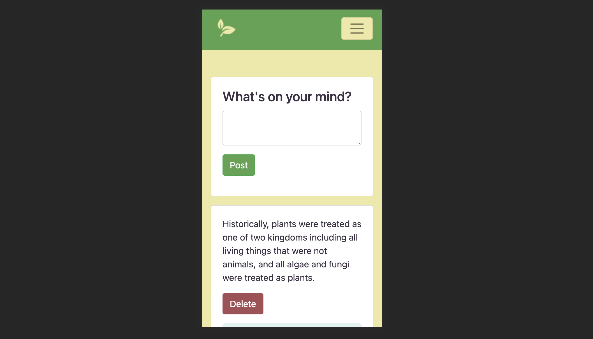
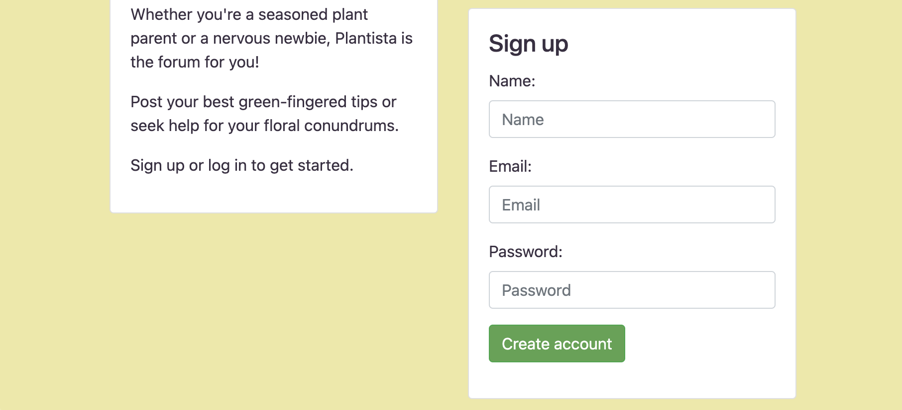
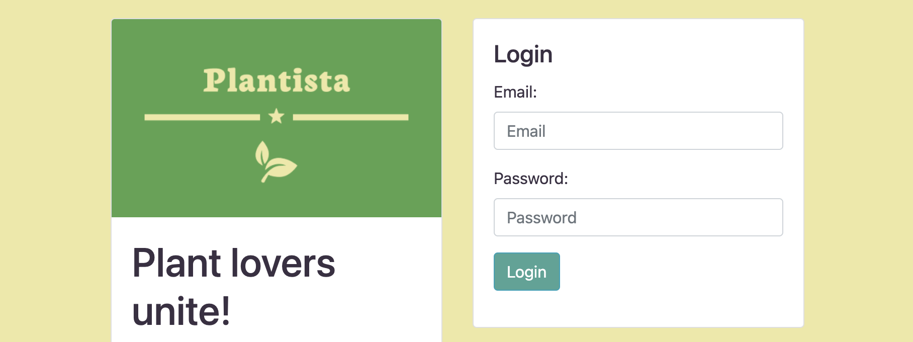
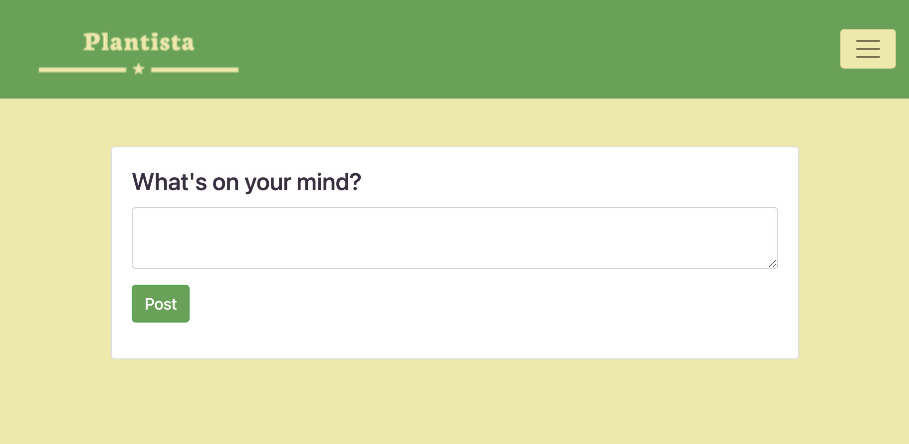
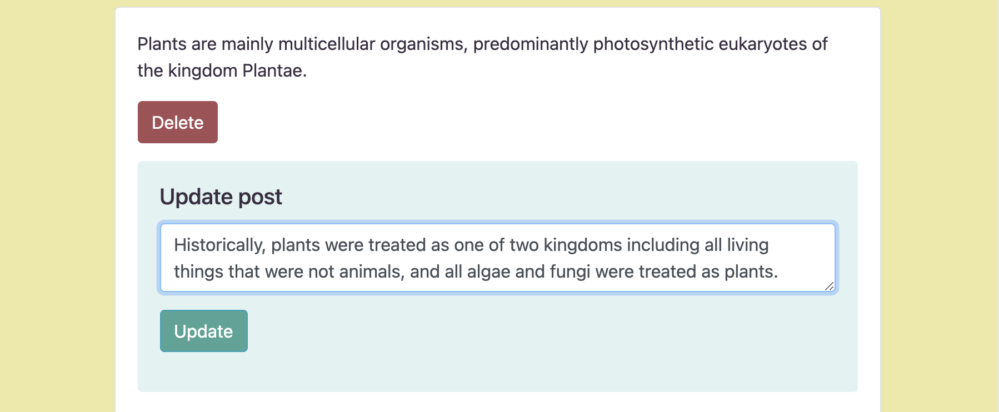
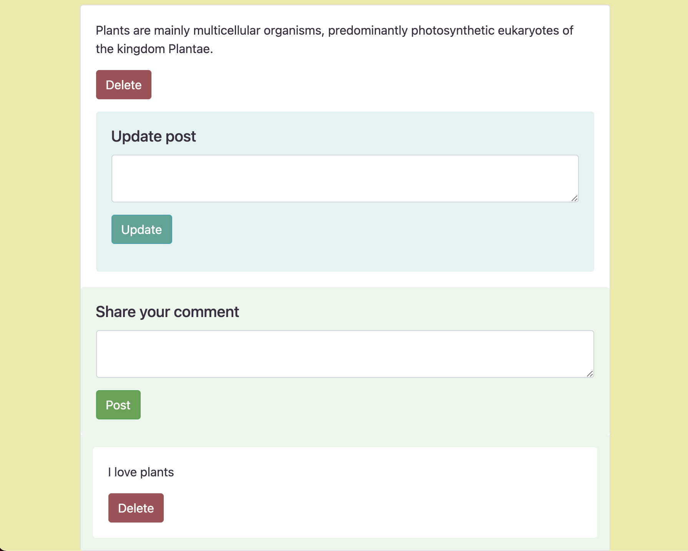

# Welcome to Plantista Webforum
Last updated: 15-April-2021

Plant lovers unite! Whether you’re a seasoned plant parent or a nervous newbie, Plantista is the online forum for you!
Post your best green-fingered tips or seek help for your floral conundrums.

This project is a Full Stack Application created, tested and implemented by the following SDA members: En-Chi Liu, Diana Bao, Pei-Nen Chee, Qinyu Jia and Yashaswini Seeta  

The project's main purpose is to serve as a real-life practice of working in a collaborating environment. The [starter template repo](https://github.com/softwaredevacademy/be-mini-group-project) was provided by Software Development Academy.

## Contents

- [Technologies](https://github.com/NeuralAlchemist/senith-plantista-forum#technologies)
- [Description](https://github.com/NeuralAlchemist/senith-plantista-forum#description)
- [Getting started](https://github.com/NeuralAlchemist/senith-plantista-forum#getting-started)
- [Setup for developers](https://github.com/NeuralAlchemist/senith-plantista-forum#setup-for-developers)
- [Usage](https://github.com/NeuralAlchemist/senith-plantista-forum#usage)
- [Credits](https://github.com/NeuralAlchemist/senith-plantista-forum#credits)

## Technologies

- [Spring 2.2.0.RELEASE](https://spring.io/projects/spring-boot)
- [PostgreSQL 13-alpine](https://www.postgresql.org)
- [React 16.11.0](https://reactjs.org)
- [React Router 5.1.2](https://reacttraining.com/react-router/web/guides/quick-start)
- [Axios 0.19.0](https://github.com/axios/axios)
- [Bootstrap 4.3.1](https://getbootstrap.com/)

## Description

The functionalities of the online forum are:
- Make a post
- Update a post  
- Delete a post
- View all posts
- Write a comment on a post
- Delete a comment on a post
- View all comments on a post

## Getting started

### Running the app
1. Clone the repo using `git clone https://github.com/NeuralAlchemist/senith-plantista-forum.git`
2. Open the project in your preferred IDE/Text editor
3. Follow the instructions on [starting the database](https://github.com/NeuralAlchemist/senith-plantista-forum#starting-the-database)
4. Follow the instructions on [starting the frontend development server](https://github.com/NeuralAlchemist/senith-plantista-forum#starting-the-frontend-development-server)
5. Open your browser and navigate to http://localhost:3000
6. Have fun! :)

### Q&A and issue tracking

If you have any questions, feedback, or feature requests, don't hesitate to add an issue to the GitHub repo.


## Setup for developers
Our development environment for a full-stack web application will consist of three main parts:

1. Database (Postgres).
2. Backend server (Spring).
3. Frontend development server (React).

### Prerequisites
- `docker` and `docker-compose`.
- `nodejs`.

### Starting the database
In the root folder, run
```
docker-compose up
```

### Starting the backend server
Open the root folder and run
```
./gradlew bootRun
```

### Starting the frontend development server
The frontend application is in the directory `frontend`. From there, run 
```
npm install
```
to install all the dependencies needed for the project.

Then start the frontend application by running
```
npm start
```
## Usage
The web app design responds to your device sreen. Try using it on mobiles (example below), tablets or desktops.  

### Create an account
- Enter your name, email and password in the Sign up box.  
- Click "Create account" and you will be taken to the home page.




### Login
- On future visits, just enter your email and password in the Login box to enter the forum.



### Create a post
- Type your thoughts into the text area under "What's on your mind?"
- Click the Post button



### Update/delete a post
- Update a post by entering the new post message in the text area and click the "Update" button.  
- Delete a post by clicking the "Delete" button under your post message.  



### Add/delete a comment
- Type your comment in the text area under the post that you want to comment on.
- Click the "Post" button under the comment text area


## Credits

- Many thanks to all the amazing work from the core team!
- KTH [Software Development Academy](https://sdaproject.se/) staff
- [Novare Potential](https://www.novarepotential.com/)
- Logo via [Hatchful](https://hatchful.shopify.com/)
- Homepage plant photo by [Prudence Earl](https://unsplash.com/@prudenceearl?utm_source=unsplash&utm_medium=referral&utm_content=creditCopyText) on [Unsplash](https://unsplash.com/s/photos/plants?utm_source=unsplash&utm_medium=referral&utm_content=creditCopyText)
  
